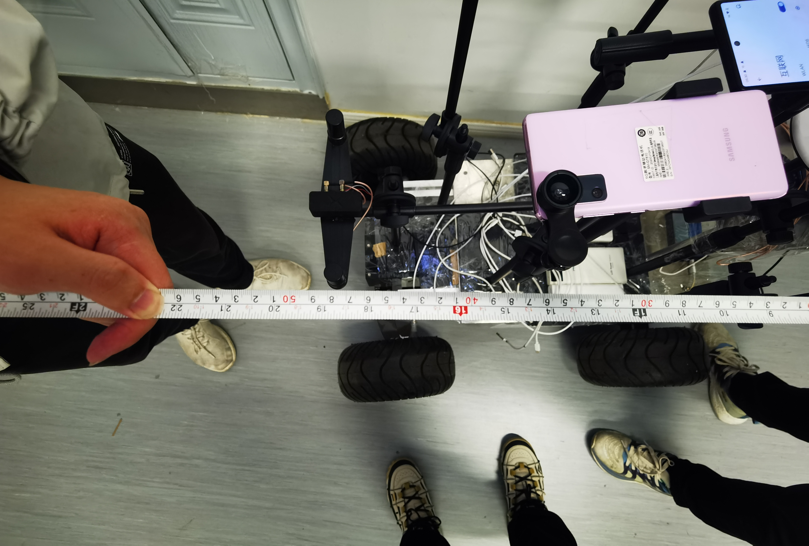

# High-Quality Fisheye Sky Image Dataset

This repository provides a **high-quality fisheye sky image dataset** designed for  
**sky segmentation** and **vision-assisted GNSS NLOS/LOS satellite identification**  
in complex urban environments.

The dataset contains **raw fisheye sky images** and their corresponding  
**pixel-level binary sky masks**, collected using a **smartphone-mounted wide-angle fisheye camera**.

---

## 📌 1. Dataset Overview

In dense urban environments, buildings, trees, and other obstacles frequently block  
satellite signals, leading to severe **GNSS multipath and NLOS errors**.

To support research on **vision-assisted GNSS navigation**, we constructed a  
**high-fidelity fisheye sky image dataset** that captures:

- Complex sky–obstruction boundaries  
- Severe fisheye radial distortion  
- Diverse urban occlusion patterns  

This dataset is intended for training and evaluating **deep-learning-based sky segmentation models**,  
such as **U-Net, Attention U-Net, and AttU-Net++**.

---

## 📷 2. Data Acquisition Setup

All images were collected using:

- A **smartphone equipped with a low-cost wide-angle fisheye camera**
- A **customized rigid mounting platform** to ensure stable upward-looking imaging
- Multiple urban environments with varying sky visibility

<p align="center">
  
</p>

Data collection scenarios include:

- **Dense high-rise urban canyons**
- **Tree-lined streets with heavy foliage occlusion**
- **Semi-open plazas and mixed-structure areas**

<p align="center">
  
</p>

---

## 📂 3. Dataset Structure

The dataset is organized as follows:

```text
.
├── raw_images/
│   ├── 0001.jpg
│   ├── 0002.jpg
│   └── ...
│
├── mask_images/
│   ├── 0001.png
│   ├── 0002.png
│   └── ...

```

## 4. Annotation Format

- All mask images are **binary**:
  - **White (pixel value = 255)** → *Sky region*
  - **Black (pixel value = 0)** → *Non-sky region*  
    (e.g., buildings, trees, poles, and other obstructions)

- Annotation strategy:
  - Manual annotation of solid occlusions (e.g., buildings)
  - Automated color-based extraction for vegetation regions
  - Mask fusion and post-processing for boundary refinement

This annotation pipeline ensures **high boundary accuracy**, particularly in challenging regions  
such as **tree gaps** and **building edges**.

---

## 5. Example Samples

Below are example pairs of raw fisheye images and their corresponding sky masks:

<p align="center">
  
  
</p>

---

## 6. Intended Use Cases

This dataset can be used for the following research tasks:

- Fisheye image sky segmentation  
- Vision-assisted GNSS **NLOS/LOS satellite detection**  
- Urban sky visibility and satellite availability analysis  
- Benchmarking segmentation models under fisheye distortion  

---

## 7. Related Publication

If you use this dataset in your research, please consider citing:

**Spatio-Temporal Attention Enhanced U-Net for Sky Segmentation and  
GNSS NLOS Satellite Identification with Smartphone Fisheye Cameras**

(The citation details will be updated after publication.)

---

## 8. License

This dataset is released for **academic and research purposes only**.

For any **commercial usage**, please contact the authors.
